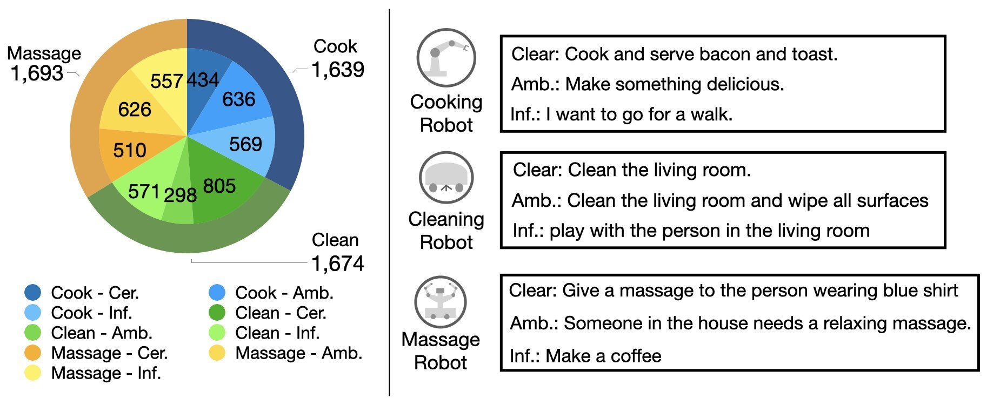

# SaGC dataset for CLARA paper

**CLARA: Classifying and Disambiguating User Commands for Reliable Interactive Robotic Agents**

[Project](https://clararobot.github.io/)
&  [Arxiv](https://arxiv.org/abs/2306.10376)

The main code can be found on [Code](https://github.com/jeongeun980906/CLARA-SaGC-Code)


Dataset components

## Dataset
The dataset is in data/agument.json 
The dataset is consisted of 
```
{
    "INDEX_NUMBER":
        {
            "SCENE":{
                '''scene information'''
                floorplan list: []
                object lists: []
                people list: []
            }
            "GOAL": Language Instruction
            "LABEL": Uncertainty Label
            "TASK": Robot Type
        }
}
```
#### Scene
Description of the environment
- **floorplan**: list of area categories in the environment
- **objects**: list of objects seen in the environment
- **people**: list of peoeple in the scene. Each person is decripted as the color of the cloth wearing

#### Goal
Language instruction (command) given to the robot

#### Robot type
- cooking robot
- cleaning robot
- massage robot

#### Uncertainty label
- 0: clear
- 1: ambiguious
- 2: infeasible
- 3: ignore

#### Examples
for example, 
```
"2": {
        "scene": {
            "floorplan": [
                "kitchen",
                "living room",
                "bedroom"
            ],
            "objects": [
                "water",
                "bacon",
                "bread",
                "pan",
                "coffee",
                "table",
                "orange juice",
                "sasuage",
                "banana",
                "apple"
            ],
            "people": [
                "person wearing blue shirt",
                "person wearing white shirt",
                "person wearing red shirt"
            ]
        },
        "goal": "Cook and serve bacon and toast on a plate.",
        "label": 0,
        "task": "cooking"
    }
```

### Dataset Generation
1. Set your key in key/[your key file.txt]

2. Craft examples. The samples used in the dataset is in data/sample.json file

3. Run agument.ipynb file
